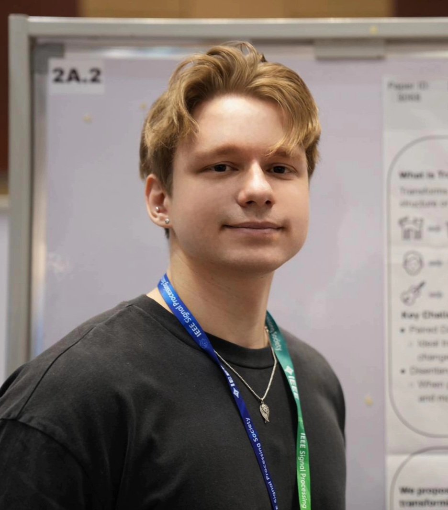

<header class="header">
  
  

    <h1>Yurii Halychanskyi</h1>
    

      
      
      
      
    

    
yuriih2 [AT] illinois [DOT] edu

  

</header>

<section class="section">
  <h2 class="section-title">About Me</h2>
  

    

      I am a PhD student at the <strong>University of Illinois Urbana-Champaign (UIUC)</strong>, advised by Volodymyr Kindratenko.
      My research focuses on <strong>generative audio modeling</strong> for <strong>cross-domain conversion</strong>, including tasks such as timbre and accent transfer in low-resource or unsupervised settings.
    

  

</section>

<section class="section">
  <h2 class="section-title">Publications</h2>

  <!-- FAC-FACodec -->
  

    

      <h3>FAC-FACodec: Controllable Zero‑Shot Foreign Accent Conversion with Factorized Speech Codec</h3>
      
<strong class="author-me">Yurii Halychanskyi</strong>, Cameron Churchwell, Yutong Wen, Volodymyr Kindratenko.

      

        <a href="#">[Abstract]</a>
        <a href="#">[Paper]</a>
      

    

  

  <!-- Latent Diffusion Bridges for Unsupervised Musical Audio Timbre Transfer -->
  

    

      <h3>Latent diffusion bridges for unsupervised musical audio timbre transfer</h3>
      

        Michele Mancusi*, <strong class="author-me">Yurii Halychanskyi</strong>*, Kin Wai Cheuk, Eloi Moliner, Chieh-Hsin Lai, Stefan Uhlich, Junghyun Koo, Marco A Martínez-Ramírez, Wei-Hsiang Liao, Giorgio Fabbro, Yuki Mitsufuji
      

      
IEEE International Conference on Acoustics, Speech and Signal Processing (ICASSP), 2025.

      

        <a href="https://arxiv.org/abs/2409.06096">[Abstract]</a>
        <a href="https://arxiv.org/pdf/2409.06096" target="_blank" rel="noopener">[Paper]</a>
      

    

  

</section>

<section class="section">
  <h2 class="section-title">Research Experience</h2>

  

    

      
      

        <h3>Sony AI</h3>
        
Tokyo, Japan

        
Research Scientist (Intern)

        
Summer 2024

      

    

    

      
      

        <h3>Machine Learning for Science (ML4SCI)</h3>
        
Remote

        
Research Intern (Google Summer of Code)

        
Summer 2021, Summer 2022

      

    

  

</section>

<section class="section">
  <h2 class="section-title">Education</h2>
  

    

      
      

        <h3>University of Illinois Urbana‑Champaign</h3>
        
Urbana, IL

        
PhD in Computer Science

        
Aug 2023 – May 2028 (expected)

      

    

    

      
      

        <h3>University of Washington</h3>
        
Seattle, WA

        
B.S. in Computer Science

        
2021 – 2023

      

    

  

</section>

<footer>
  
Last updated in Oct. 2025.

</footer>

<!--
  Note: For best results, add the referenced images (profile, logos, icons) to your images/ directory.
  You can further style this page by adding a custom CSS file or inline <style> block.
-->
