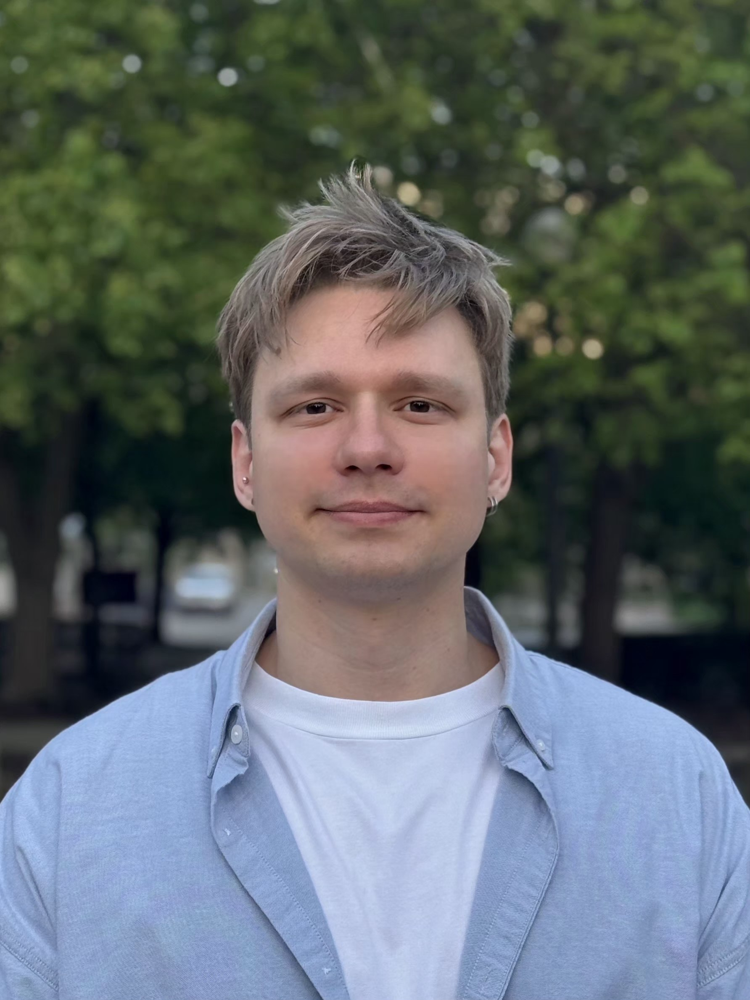
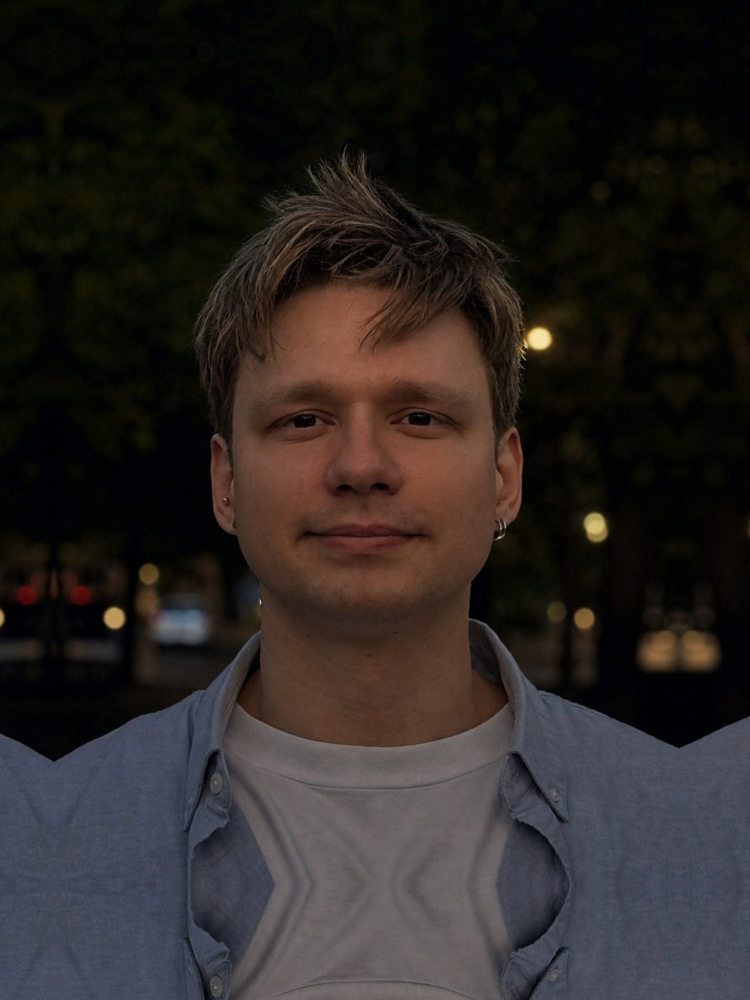
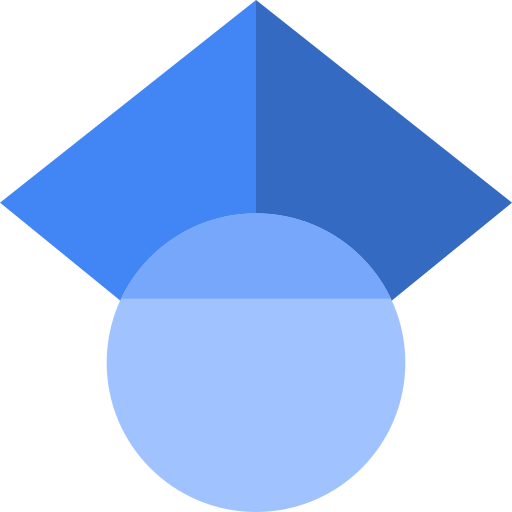

<header class="header">
  

    
    
  

  

    <h1>Yurii Halychanskyi</h1>
    

      
      
      
      
    

    
yuriih2 [AT] illinois [DOT] edu

  

</header>

<section class="section">
  <h2 class="section-title">About Me</h2>
  

    

      I am a PhD student at the <strong>University of Illinois Urbana-Champaign (UIUC)</strong>, co-advised by Volodymyr Kindratenko and Mark Hasegawa-Johnson.
      My research focuses on <strong>generative audio modeling</strong> for <strong>cross-domain conversion</strong>, including tasks such as timbre and accent transfer in low-resource or unsupervised settings.
    

  

</section>

<section class="section">
  <h2 class="section-title">Publications</h2>

  <!-- Few-Shot Synthetic Accented Speech for ASR Fine-Tuning -->
  

    

      

        Learning to Listen: ICML 2026 Workshop on ML for Audio
        Oral
      

      <h3>Few-Shot Synthetic Accented Speech for ASR Fine-Tuning: What Helps and When?</h3>
      
<strong class="author-me">Yurii Halychanskyi</strong>, Nimet Beyza Bozdag, Mark Hasegawa-Johnson, Dilek Hakkani-Tür, Volodymyr Kindratenko.

      

        <a href="https://arxiv.org/pdf/2604.27273">[Paper]</a>
        <a href="https://claussss.github.io/few_shot_accent_synthesis_demo" target="_blank" rel="noopener">[Demo]</a>
      

    

  

  <!-- Accent Conversion Survey -->
  

    

      

        Preprint
      

      <h3>Accent Conversion: A Problem-Driven Survey of Sociolinguistic and Technical Constraints</h3>
      
<strong class="author-me">Yurii Halychanskyi</strong>, Jianfeng Steven Guo, Volodymyr Kindratenko.

      

        <a href="https://arxiv.org/pdf/2604.27281">[Paper]</a>
      

    

  

  <!-- FAC-FACodec -->
  

    

      

        ICASSP 2026
        Poster
      

      <h3>FAC-FACodec: Controllable Zero‑Shot Foreign Accent Conversion with Factorized Speech Codec</h3>
      
<strong class="author-me">Yurii Halychanskyi</strong>, Cameron Churchwell, Yutong Wen, Volodymyr Kindratenko.

      

        <a href="https://arxiv.org/pdf/2510.10785">[Paper]</a>
        <a href="https://claussss.github.io/accent_control_demo/" target="_blank" rel="noopener">[Demo]</a>
      

    

  

  <!-- Latent Diffusion Bridges for Unsupervised Musical Audio Timbre Transfer -->
  

    

      

        ICASSP 2025
        Poster
      

      <h3>Latent diffusion bridges for unsupervised musical audio timbre transfer</h3>
      

        Michele Mancusi*, <strong class="author-me">Yurii Halychanskyi</strong>*, Kin Wai Cheuk, Eloi Moliner, Chieh-Hsin Lai, Stefan Uhlich, Junghyun Koo, Marco A Martínez-Ramírez, Wei-Hsiang Liao, Giorgio Fabbro, Yuki Mitsufuji.
      

      
* Equal contribution

      

        <a href="https://arxiv.org/pdf/2409.06096" target="_blank" rel="noopener">[Paper]</a>
        <a href="https://sony.github.io/diffusion-timbre-transfer/" target="_blank" rel="noopener">[Demo]</a>
      

    

  

</section>

<section class="section">
  <h2 class="section-title">Research Experience</h2>

  

    

      
      

        <h3>Meta</h3>
        
London, United Kingdom

        
Research Scientist Intern

        
Summer 2026

      

    

    

      
      

        <h3>Sony AI</h3>
        
Tokyo, Japan

        
Research Scientist Intern

        
Summer 2024

      

    

    

      
      

        <h3>Machine Learning for Science (ML4SCI)</h3>
        
Remote

        
Research Scientist Intern (Google Summer of Code)

        
Summer 2021, Summer 2022

      

    

  

</section>

<section class="section">
  <h2 class="section-title">Education</h2>
  

    

      
      

        <h3>University of Illinois Urbana‑Champaign</h3>
        
Urbana, IL

        
PhD in Computer Science

        
Aug 2023 – May 2028 (Expected)

      

    

    

      
      

        <h3>University of Washington</h3>
        
Seattle, WA

        
B.S. in Computer Science

        
2021 – 2023

      

    

  

</section>

<section class="section">
  <h2 class="section-title">Presentations</h2>
  

    

      Will present <strong>Few-Shot Synthetic Accented Speech for ASR Fine-Tuning: What Helps and When?</strong> at the <a href="https://mlforaudioworkshop.github.io/" target="_blank" rel="noopener">Learning to Listen: ICML 2026 Workshop on Machine Learning for Audio</a> in Seoul, Korea.
      Upcoming · July 10, 2026
    

    

      Presented <strong>FAC-FACodec: Controllable Zero‑Shot Foreign Accent Conversion with Factorized Speech Codec</strong> at <strong>ICASSP 2026</strong> — session <em>SLP-P6: Neural Vocoders and Codecs</em>.
      Tuesday, May 5, 2026 · 14:00–16:00
    

    

      Presented <strong>FAC-FACodec: Controllable Zero‑Shot Foreign Accent Conversion with Factorized Speech Codec</strong> at the 4th Annual NCSA Student Research Conference.
      April 23, 2026
    

    

      Presented <strong>FAC-FACodec: Controllable Zero‑Shot Foreign Accent Conversion with Factorized Speech Codec</strong> and <strong>Few-Shot Synthetic Accented Speech for ASR Fine-Tuning: What Helps and When?</strong> at <a href="https://nlp.cs.illinois.edu/msld.html" target="_blank" rel="noopener">Midwest Speech and Language Days (MSLD) 2026</a>.
      April 15, 2026
    

  

</section>

<!--
  Note: For best results, add the referenced images (profile, logos, icons) to your images/ directory.
  You can further style this page by adding a custom CSS file or inline <style> block.
-->
